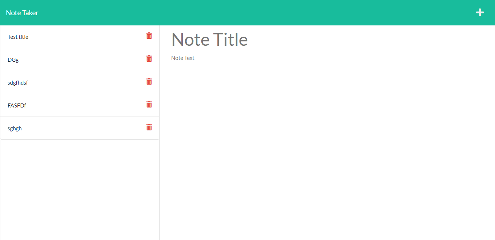

# Note Taker Using Express.js

## User Story

```
AS A small business owner
I WANT to be able to write and save notes
SO THAT I can organize my thoughts and keep track of tasks I need to complete
```

## Description:
```
 This app uses Node.js and Express.js to generate a note taking web page so the User can write, save and delete notes.  

 Existing notes are listed in the left-hand column with empty fields on the right-hand side for the new note’s title and text.

 ```
 

## License: 

[](MIT)

## Tech Stack:
 > * Node.js 
 > * Express.js 
 > * JavaScript
 > * HTML
 > * CSS 


## Link to Deployed App

> [Link to app on Heroku](https://note-taking-app-crs.herokuapp.com/)

## Contributors:

> [https://github.com/chuck2076](https://github.com/chuck2076)

## Questions:

> Chuck Stephens 
> [https://github.com/chuck2076](https://github.com/chuck2076) 

>Feel free to get in touch! 
> [chuckstephens2076@gmail.com](mailto:chuckstephens2076@gmail.com)


